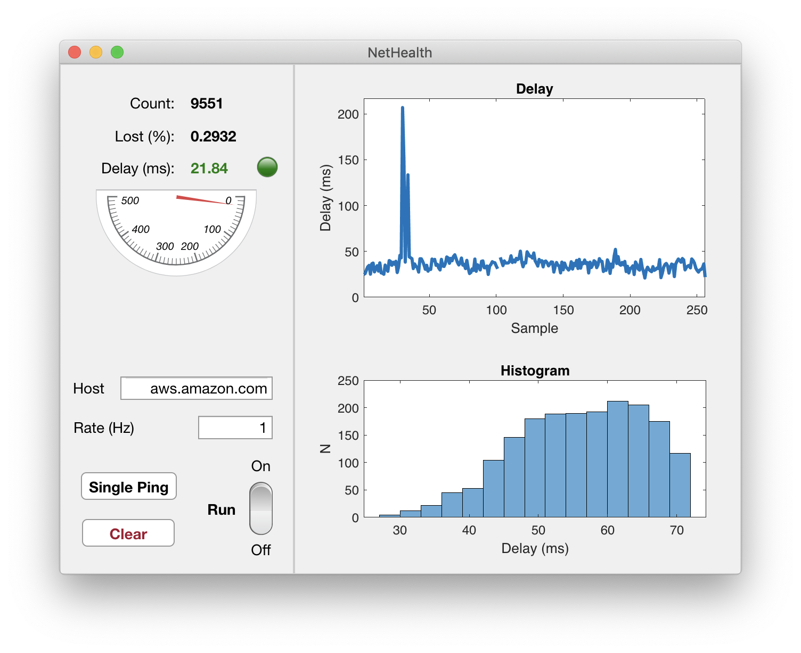

# NetHealth

## Overview

Simple MATLAB GUI to test network health on UNIX-like systems by collecting ping delay statistics to a given host. The host to be pinged is either a default in the GUI, or taken from the environment variable PING_HOST, if available.

## Screenshot

## Installing

### OS X
If you don't have the MATLAB runtime package installed (you probably don't) you'll have to download the "MyAppInstaller_web.app" from package from one of the Releases. This will not only provide the compiled app, but will also download and install the MATLAB runtime. Warning: the run time is over 2 GB, and it's probably not worth it for a dumb app like this.

### Linux
You'll have to have access to MATLAB to run this on Linux, as I don't have access to a Linux version of MATLAB to compile it. If anybody wants to compile a Linux version, please feel free to do so and send me a PR.
